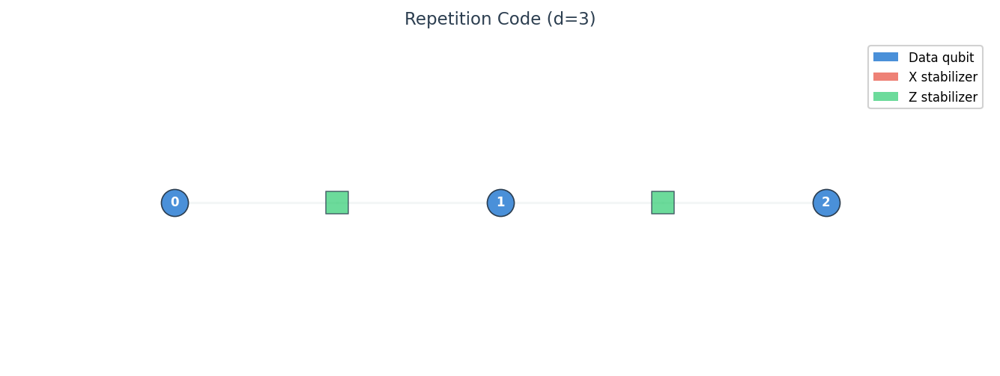
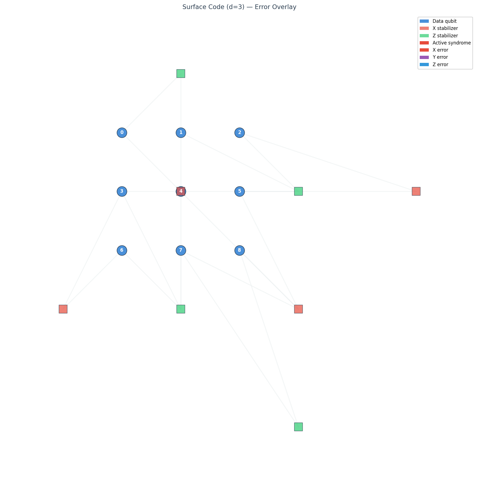
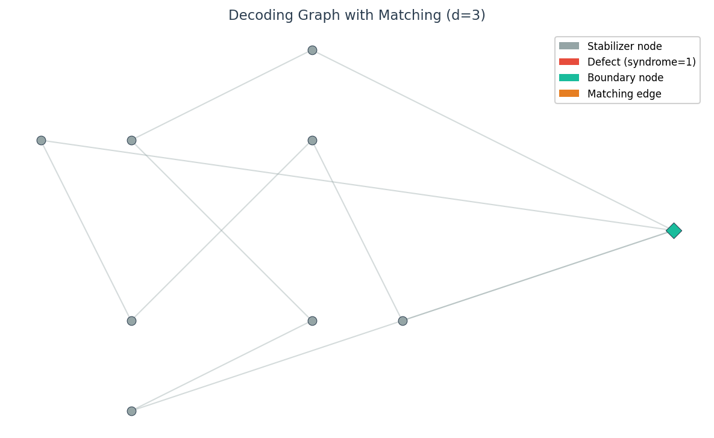
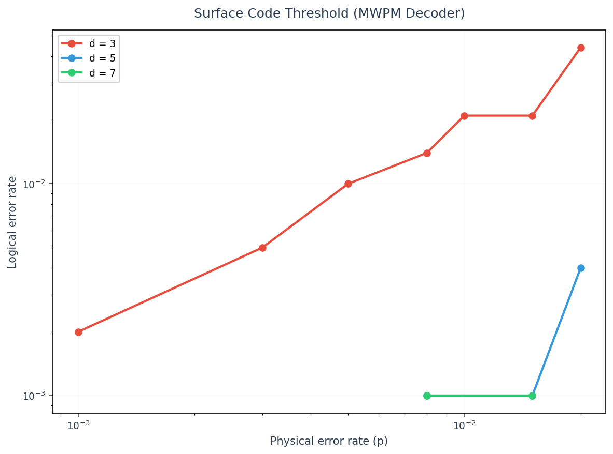

# QENS

**Quantum Error and Noise Simulation SDK** -- a Python-native toolkit for simulating quantum errors, decoding syndromes, and visualizing error-correcting codes.

QENS provides a layered API for researchers, educators, and engineers working with quantum error correction. It ships with built-in support for surface codes, repetition codes, and color codes, multiple decoder implementations, and publication-quality visualization -- all with only `numpy` and `matplotlib` as dependencies.

## Installation

```bash
pip install qens
```

For development (includes pytest, mypy, ruff):

```bash
git clone https://github.com/quipo/qens.git
cd qens
pip install -e ".[dev]"
```

Requires Python 3.11+.

## Quickstart

```python
import qens

code = qens.RepetitionCode(distance=5)
noise = qens.DepolarizingError(p=0.05)
decoder = qens.LookupTableDecoder(code)

result = qens.ThresholdExperiment.single_point(
    code=code, noise_model=noise, decoder=decoder, shots=10_000, seed=42
)

print(f"Logical error rate: {result.logical_error_rate:.4f}")
```

<p align="center">
  
</p>

## Documentation

Full documentation is in the [`docs/`](docs/) directory:

| Guide | Description |
|-------|-------------|
| [Getting Started](docs/getting-started.md) | Installation, first simulation, project structure |
| [Core Concepts](docs/concepts.md) | QEC background, Pauli errors, CSS codes, Pauli frame model |
| [Error Models](docs/error-models.md) | All 10 noise models with examples |
| [QEC Codes](docs/codes.md) | Repetition, surface, and color codes |
| [Decoders](docs/decoders.md) | Lookup, MWPM, and union-find decoders |
| [Simulation](docs/simulation.md) | Monte Carlo sampling, threshold sweeps, Pauli frame simulator |
| [Visualization](docs/visualization.md) | Circuit diagrams, lattice views, decoding graphs, plots |
| [Extending QENS](docs/extending.md) | Custom error models, codes, decoders, visualizers |
| [API Reference](docs/api-reference.md) | Complete reference for every class and function |
| [Architecture](docs/architecture.md) | Package design, dependency graph, simulation pipeline |

## Feature Highlights

- **Circuits** -- Fluent builder API for quantum circuits (`Circuit(3).h(0).cx(0, 1).measure_all()`)
- **Error Models** -- 10 built-in noise models (depolarizing, bit-flip, phase-flip, measurement, crosstalk, leakage, correlated Pauli, and more) with composition support. See [Error Models](docs/error-models.md).
- **QEC Codes** -- Repetition, surface, and color codes with stabilizers, check matrices, and syndrome circuits. See [QEC Codes](docs/codes.md).
- **Decoders** -- Lookup table, MWPM, and union-find decoders. See [Decoders](docs/decoders.md).
- **Simulation** -- Monte Carlo sampling, threshold sweeps, and Pauli frame simulation. See [Simulation](docs/simulation.md).
- **Visualization** -- Circuit diagrams, lattice views, decoding graphs, and statistical plots. See [Visualization](docs/visualization.md).
- **Extensible** -- ABC + Registry pattern for adding custom error models, codes, and decoders. See [Extending QENS](docs/extending.md).

<p align="center">
  
  
</p>
<p align="center">
  
</p>

## Architecture

```
qens/
  core/        Types, Circuit, Gate, NoiseChannel, Registry
  noise/       ErrorModel ABC + 8 built-in models + ComposedNoiseModel
  codes/       QECCode ABC + RepetitionCode, SurfaceCode, ColorCode
  decoders/    Decoder ABC + Lookup, UnionFind, MWPM
  simulation/  NoisySampler, PauliFrameSimulator, ThresholdExperiment
  viz/         Circuit diagrams, lattice views, decoding graphs, stats plots
  utils/       Pauli algebra, GF(2) sparse matrices, seeded RNG
```

## Examples

```bash
python3 examples/01_quickstart.py              # Basic workflow
python3 examples/02_surface_code_threshold.py   # Threshold sweep
python3 examples/03_custom_noise_model.py       # Composed noise + visualization
python3 examples/04_visualization_gallery.py    # All visualization types
```

## Testing

```bash
pytest                    # 194 tests
ruff check src/qens/      # Lint
```

## License

MIT
